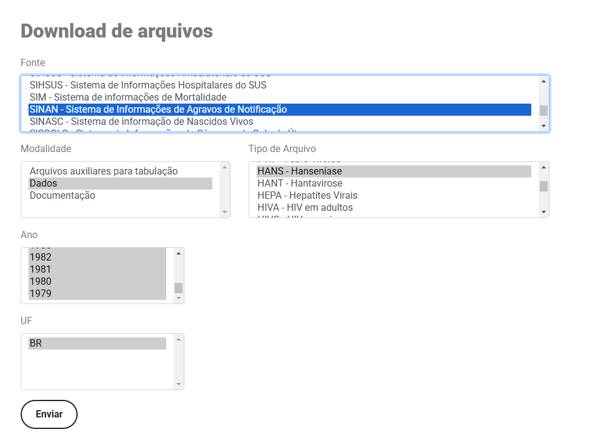
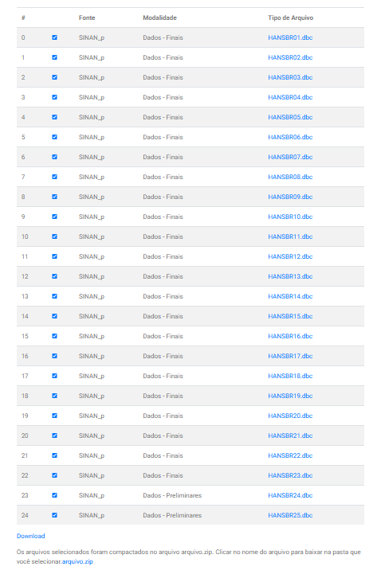

## Ambiente Virtual Python

### Criação ambiente
```
python -m venv .\venv_healt
```

### Ativação do ambiente

#### No Windows

```
.\venv_healt\Scripts\activate
```

#### No Linux

```
source ./venv_healt/bin/activate
```

### Desativar ambiente

```
deactivate
```

## Requeriments


### Instalar Requeriments

```
pip install -r requirements.txt
```

### Criar Requeriments

```
pip freeze > requirements.txt
```


## Tratar os dados da página datasus 

url: https://datasus.saude.gov.br/transferencia-de-arquivos/#



Foram selecionados:

- Fonte: SINAN - Sistema de Informações de Agravos de Notificação

- Modalidade: Dados

- Tipo de Arquivo: HANS - Hanseníase

- Ano: (Selecionado todos)

- UF: BR

Clicando em Enviar gera os arquivos .dbc



Clicando em Download (em azul) que está abaixo na lista é só aguardar ate gerar o texto abaixo, assim basta clicar em arquivo.zip (em azul) que irá baixar em .zip os arquivos escolhidos.


### Conversão do .dbc em dataframe e opção de gerar o .csv

- Instale a biblioteca abaixo
```
pip install pandas datasus-dbc dbfread
```

e siga os passos do convert_dbc.ipynb alterando apenas os caminhos do arquivo .dbc.