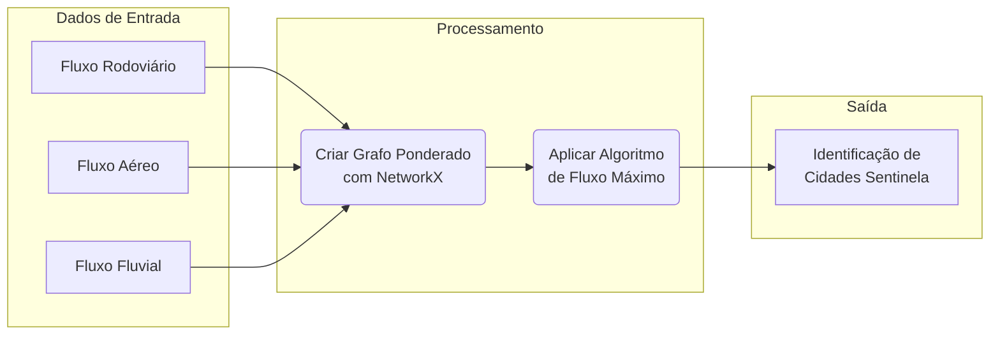
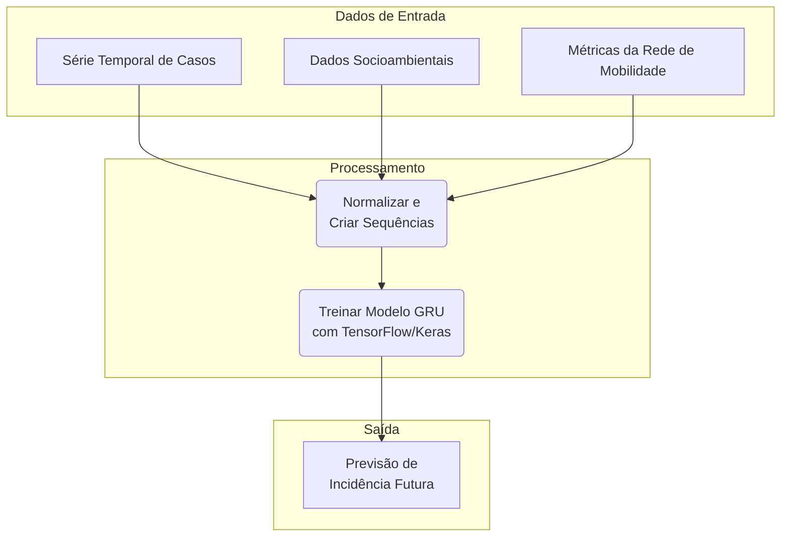

# Fluxo de Trabalho para Análise e Previsão da Hanseníase

Este documento descreve a metodologia conceitual apresentada no notebook `wsus_nova_rotina.ipynb`. O fluxo de trabalho utiliza dados simulados para demonstrar como uma combinação de análise de redes, machine learning e visualização de dados pode ser usada para estudar e prever a disseminação da hanseníase no Brasil.

## Diagrama Geral do Fluxo

O diagrama abaixo oferece uma visão geral de como as diferentes etapas do projeto se conectam, desde a análise de mobilidade até a modelagem preditiva e a avaliação ética.

```mermaid
graph TD
    subgraph "Fontes de Dados (Simuladas)"
        A[Dados de Transporte<br/>(Aéreo, Rodoviário, Fluvial)]
        B[Dados de Pacientes<br/>(SINAN, Socioeconômicos)]
        C[Dados Socioespaciais<br/>(IBGE)]
        D[Dados Genômicos<br/>(SARS-CoV-2 para validação)]
    end

    subgraph "Análise e Modelagem"
        E[Etapa 1: Construir Rede de Mobilidade]
        F[Etapa 2: Treinar Modelo Preditivo GRU]
        G[Etapa 3: Validar Rotas com Dados Reais]
        H[Etapa 4: Identificar Fatores de Risco com SHAP]
        I[Etapa 5: Analisar Heterogeneidade com Clustering]
    end

    subgraph "Resultados e Discussão"
        J[Locais Sentinela para Vigilância]
        K[Previsão de Incidência da Doença]
        L[Validação do Modelo de Disseminação]
        M[Preditores de Diagnóstico Tardio]
        N[Grupos de Municípios com Dinâmicas Distintas]
        O[Etapa 6: Considerações Éticas]
    end

    A --> E
    C --> E
    E --> J
    E --> F
    B --> F
    F --> K
    E --> G
    D --> G
    G --> L
    B --> H
    H --> M
    C --> I
    I --> N
    B --> O
```

---

## Etapa 1: Construção da Rede de Mobilidade e Identificação de Locais Sentinela

**Objetivo:** Criar uma rede que represente o fluxo de pessoas entre os municípios brasileiros e usar essa rede para identificar cidades estratégicas para a detecção precoce de doenças.

**Processo:**
1.  Agrega dados de transporte (rodoviário, aéreo, fluvial) para quantificar o fluxo entre municípios.
2.  Constrói um grafo (rede) onde os municípios são os "nós" e as conexões de transporte são as "arestas", ponderadas pelo volume de passageiros.
3.  Aplica algoritmos de teoria dos grafos, como o de **fluxo máximo (Ford-Fulkerson)**, para identificar os caminhos mais críticos e os nós mais centrais.

**Resultado:** Uma lista de "cidades sentinela" que, devido à sua alta conectividade, são locais ideais para monitorar e detectar a chegada de patógenos.



---

## Etapa 2: Modelagem Preditiva Espaço-Temporal com GRU

**Objetivo:** Prever a incidência futura de hanseníase em diferentes municípios.

**Processo:**
1.  Cria um conjunto de dados de série temporal, combinando:
    *   Incidência histórica da doença.
    *   Fatores socioambientais (IDH, densidade populacional, etc.).
    *   Métricas da rede de mobilidade (centralidade do município, etc.).
2.  Os dados são transformados em sequências (ex: usar dados dos últimos 12 meses para prever o próximo).
3.  Treina um modelo de Rede Neural Recorrente, especificamente uma **GRU (Gated Recurrent Unit)**, que é eficaz para aprender padrões em dados sequenciais.

**Resultado:** Um modelo capaz de gerar previsões sobre o número de futuros casos de hanseníase por localidade.



---

## Etapa 3: Validação do Modelo com Dados Genômicos do SARS-CoV-2

**Objetivo:** Verificar se as rotas de disseminação previstas pelo modelo de mobilidade correspondem a padrões de disseminação de uma doença real.

**Processo:**
1.  Extrai as rotas de disseminação mais prováveis do grafo de mobilidade (Etapa 1).
2.  Coleta dados reais (neste caso, simulados com base em estudos) da dispersão de variantes do SARS-CoV-2, mapeadas através de dados genômicos.
3.  Compara as rotas previstas com as rotas reais para calcular a acurácia do modelo.

**Resultado:** Uma medida de quão bem o modelo de mobilidade consegue prever a disseminação geográfica real de um patógeno, aumentando a confiança em suas previsões.

---

## Etapa 4: Análise de Fatores de Risco para Diagnóstico Tardio

**Objetivo:** Identificar os fatores socioeconômicos que mais contribuem para que um paciente seja diagnosticado tardiamente (com incapacidades físicas - GIF2).

**Processo:**
1.  Utiliza dados simulados de pacientes, incluindo informações demográficas, socioeconômicas e o resultado do diagnóstico (precoce ou tardio).
2.  Treina um modelo de classificação (ex: **Random Forest**) para prever a probabilidade de um diagnóstico tardio.
3.  Aplica a técnica de **SHAP (SHapley Additive exPlanations)** para interpretar as previsões do modelo e medir a importância de cada fator (idade, escolaridade, etc.).

**Resultado:** Um ranking dos fatores de risco mais impactantes, permitindo o direcionamento de políticas de saúde pública para populações vulneráveis.

```mermaid
graph LR
    subgraph "Dados de Entrada"
        D1[Dados de Pacientes<br/>(Idade, Escolaridade, Renda...)]
    end

    subgraph "Processamento"
        P1(Treinar Modelo<br/>Random Forest)
        P2(Aplicar SHAP<br/>para Interpretabilidade)
    end

    subgraph "Saída"
        S1[Importância de cada<br/>Fator de Risco]
    end

    D1 --> P1 --> P2 --> S1
```

---

## Etapa 5: Avaliação da Heterogeneidade Socioespacial

**Objetivo:** Investigar se a dinâmica da hanseníase varia entre diferentes contextos socioeconômicos no Brasil.

**Processo:**
1.  Agrupa os municípios em "clusters" com base em suas características socioeconômicas e demográficas.
2.  Utiliza técnicas como **PCA (Análise de Componentes Principais)** para reduzir a dimensionalidade dos dados e **K-Means** para criar os clusters.
3.  Analisa a incidência da doença em cada cluster para identificar padrões distintos.

**Resultado:** A identificação de grupos de municípios com dinâmicas de doença semelhantes, sugerindo que estratégias de intervenção podem precisar ser adaptadas para cada tipo de região.

---

## Etapa 6: Desafios Éticos e Metodológicos

**Objetivo:** Discutir as implicações éticas do uso de Big Data para uma doença estigmatizada como a hanseníase.

**Processo:**
1.  Demonstra como a combinação de dados aparentemente anônimos (município, idade, gênero) pode levar à **reidentificação** de indivíduos.
2.  Discute conceitualmente técnicas de preservação de privacidade, como a **k-anonimidade** e a **privacidade diferencial**, que adicionam "ruído" aos dados para proteger a identidade dos pacientes.

**Resultado:** Uma reflexão sobre o equilíbrio necessário entre a utilidade dos dados para a pesquisa em saúde e o direito fundamental à privacidade do paciente.
file_path:
d:\python\data_health\fluxo_mobilidade.md